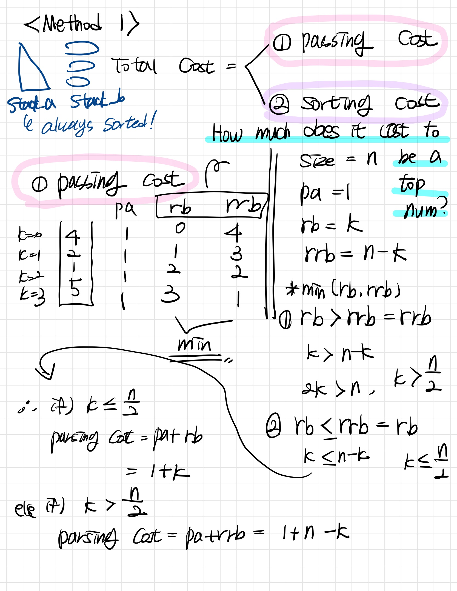

# Push_swap
### what to study
- Decide which of several data structures to use: array stack, linked stack, doubly linked stack, circular stack
- Compare and choose one of several sorting algorithms: merge sort, quick sort, greedy

### Mandatory part
The game consists of 2 stacks, called a and b

Stack a : receives int numbers, no duplication  
Stack b : empty  

goal : sort numbers in ascending order into stack a  

### tester
[gui][gui]   
[tester][tester]   

[gui]: https://pypi.org/project/push-swap-gui/
[tester]: https://github.com/gemartin99/Push-Swap-Tester

```c
int	main(int argc, char **argv)
{
	t_stack	*stack_a;
	t_stack	*stack_b;

	if (argc < 2)
		return (0);
	stack_a = create_stack();
	if (!stack_a)
		return (ERROR);
	if (fill_stack(stack_a, argc, argv) == -1)
		return (ERROR);
	stack_b = create_stack();
	if (!stack_b)
		return (ERROR);
	if (is_stack_sorted_a(stack_a))
		destroy_stacks_and_exit(stack_a, stack_b, 0);
	if (sort_a(stack_a, stack_b) == COMPLETE)
	{
		destroy_stacks_and_exit(stack_a, stack_b, 0);
		return (0);
	}
	move_init(stack_a, stack_b);
	apply_greedy(stack_a, stack_b);
	destroy_stacks_and_exit(stack_a, stack_b, 0);
	return (0);
}
```
## Fill stack
```c
int	fill_stack(t_stack *stack_a, int argc, char **argv)
{
	int	i;

	i = 1;
	while (i < argc)
	{
		if (valid_args(argv[i], stack_a) == ERROR)
		{
			destroy_stack(&stack_a);
			return (ERROR);
		}
		i++;
	}
	return (0);
}
```

```c
int	valid_args(char *av, t_stack *stack_a)
{
	long long	data;
	char		**numbers;
	int			i;

	if (av == NULL)
		return (error_return("Error\n", ERROR));
	i = 0;
	numbers = ft_split(av, ' ');
	if (!numbers)
		error_exit(stack_a, NULL);
	while (numbers[i])
	{
		if (is_number(numbers[i]) == ERROR)
			error_exit(stack_a, NULL);
		data = ft_atoi_extension(numbers[i]);
		if (is_int(data) == ERROR)
			error_exit(stack_a, NULL);
		if (check_duplicate(stack_a, (int)data) == ERROR)
			error_exit(stack_a, NULL);
		push(stack_a, (int)data);
		i++;
	}
	free_two_dementional_array(numbers);
	return (0);
}
```
## Operations


### sa, sb, ss
```c
static void	swap(t_stack *list)
{
	int	temp;

	if (list->top && list->top->prev)
	{
		temp = list->top->data;
		list->top->data = list->top->prev->data;
		list->top->prev->data = temp;
	}
}
```
```c
void	sa(t_stack *stack_a)
{
	swap(stack_a);
	ft_printf("sa\n");
}

void	sb(t_stack *stack_b)
{
	swap(stack_b);
	ft_printf("sb\n");
}

void	ss(t_stack *stack_a, t_stack *stack_b)
{
	swap(stack_a);
	swap(stack_b);
	ft_printf("ss\n");
}
```

### ra, rb, rr
```c
static void	rotate(t_stack *list)
{
	t_stack_node	*head;
	t_stack_node	*top;

	if (list == NULL || list->head == NULL || list->head->next == NULL)
		return ;
	head = list->head;
	top = list->top;
	top->next = head;
	head->prev = top;
	list->head = top;
	list->top = top->prev;
	list->top->next = NULL;
	list->head->prev = NULL;
}
```
```c
void	ra(t_stack *stack_a)
{
	rotate(stack_a);
	ft_printf("ra\n");
}

void	rb(t_stack *stack_b)
{
	rotate(stack_b);
	ft_printf("rb\n");
}

void	rr(t_stack *stack_a, t_stack *stack_b)
{
	rotate(stack_a);
	rotate(stack_b);
	ft_printf("rr\n");
}
```

### rra, rrb, rrr
```c
static void	reverse_rotate(t_stack *list)
{
	t_stack_node	*head;
	t_stack_node	*top;

	if (list == NULL || list->head == NULL || list->head->next == NULL)
		return ;
	head = list->head;
	top = list->top;
	top->next = head;
	head->prev = top;
	list->top = head;
	list->head = head->next;
	list->top->next = NULL;
	list->head->prev = NULL;
}
```
```c
void	rra(t_stack *stack_a)
{
	reverse_rotate(stack_a);
	ft_printf("rra\n");
}

void	rrb(t_stack *stack_b)
{
	reverse_rotate(stack_b);
	ft_printf("rrb\n");
}

void	rrr(t_stack *stack_a, t_stack *stack_b)
{
	reverse_rotate(stack_a);
	reverse_rotate(stack_b);
	ft_printf("rrr\n");
}
```
```c
static void	push_to(t_stack *from, t_stack *to)
{
	int	data;

	if (from->top)
	{
		data = pop(from);
		push(to, data);
	}
}

void	pa(t_stack *stack_a, t_stack *stack_b)
{
	push_to(stack_b, stack_a);
	ft_printf("pa\n");
}

void	pb(t_stack *stack_a, t_stack *stack_b)
{
	push_to(stack_a, stack_b);
	ft_printf("pb\n");
}
```

## Sort by Greedy
A greedy algorithm is a type of algorithm that makes locally optimal choices at each step in the hope of finding a global optimum solution. In the context of sorting algorithms, a greedy approach can involve calculating the cost of each node to the sorting stack and choosing the best action based on that cost.  

To implement this approach, you can first move every node in the unsorted list to a second stack called stack_b. However, if you have a standard (pivot number), you can categorize the numbers into different groups. For example, let's say you have two pivot numbers - a small pivot that represents the smallest one-third of the numbers, and a large pivot that represents the largest two-thirds of the numbers.  

1. Pass the numbers that are larger than the big pivot to another stack (stack_b).
2. If a number is smaller than the small pivot, move it to the bottom of the original stack (stack_a).
3. Once you've completed this process, you'll have three parts of the numbers: the ones that are bigger than the big pivot in stack_a, the ones that are smaller than the small pivot but bigger than the big pivot at the top of stack_b, and the ones that are smaller than the small pivot at the bottom of stack_b.
4. Finally, move the numbers from stack_a to stack_b. Now you'll have three parts of the numbers in stack_b - the ones that are larger than the big pivot, the ones that are between the big and small pivots, and the ones that are smaller than the small pivot.
This approach divides the numbers into three groups based on their size relative to the two pivot numbers. By doing this, you can reduce the number of comparisons required to sort the list, and the algorithm becomes more efficient.

```c
void	move_init(t_stack *stack_a, t_stack *stack_b)
{
	get_pivot(stack_a);
	move_small_and_middle_to_b(stack_a, stack_b);
	move_big_to_b(stack_a, stack_b);
}

```
#### get pivot
```c
void	get_pivot(t_stack *stack)
{
	int	*arr;
	int	size;
	int	small_pivot_idx;
	int	big_pivot_idx;
	int	range;

	size = stack_size(stack);
	if (is_stack_empty(stack) || size == 1)
		return ;
	arr = (int *)malloc(size * sizeof(int));
	if (!arr)
		exit(1);
	stack_to_array(stack, arr, size);
	quicksort(arr, 0, size - 1);
	range = size / 3;
	small_pivot_idx = range - 1;
	big_pivot_idx = range * 2 - 1;
	if (size % 3 == 2)
		big_pivot_idx++;
	stack->small_pivot = arr[small_pivot_idx];
	stack->big_pivot = arr[big_pivot_idx];
	free(arr);
}
```
#### using pivot, split stack
```c
static void	move_small_and_middle_to_b(t_stack *stack_a, t_stack *stack_b)
{
	t_stack_node	*dummy;
	size_t			size;

	dummy = stack_a->top;
	size = stack_a->size;
	while (dummy != NULL && size)
	{
		if (stack_a->big_pivot >= dummy->data)
		{
			dummy = dummy->prev;
			pb(stack_a, stack_b);
			if (stack_b->top->data <= stack_a->small_pivot)
				rb(stack_b);
		}
		else
		{
			dummy = dummy->prev;
			ra(stack_a);
		}
		size--;
	}
}

static void	move_big_to_b(t_stack *stack_a, t_stack *stack_b)
{
	t_stack_node	*dummy;

	dummy = stack_a->top;
	while (dummy != NULL && sort_a(stack_a, stack_b) == CONTINUE)
	{
		dummy = dummy->prev;
		pb(stack_a, stack_b);
	}
}
```

### sort by greedy
#### Cost Calculation

There are two components to the cost calculation:  

The first component is the cost of moving the selected node from stack_b to stack_a. The 'pa' operation always has a cost of 1. The 'rb' operation starts from zero at the top and increases by 1 as you move down the stack. On the other hand, the 'rrb' operation starts from zero at the bottom and increases by 1 as you move up. Therefore, the total cost of moving the selected node is 1 + min(rb, rrb), which can be represented as either 'index' or 'size - index'.  

The second component is the cost of sorting stack_a. Since stack_a is always sorted, we can determine the exact position of the numbers in stack_b. Using the index information, we can easily calculate the cost of sorting. The cost of 'ra' is equal to the index, while the cost of 'rra' is equal to 'size - index'. We also know that if we run 'ra', we should run 'rra' as many times as 'ra' to maintain the sorted state of stack_a. Similarly, if we run 'rra', we should run 'ra' 'ra times + 1' times to keep stack_a sorted. As a result, the total cost of sorting is either 'index * 2' or '(size - index) * 2 + 1'.  

#### Optimisation

Instead of always sorting stack_a into triangles, consider allowing stack_a to consist of a rectangle and small triangles, which are equivalent to large triangles divided by a line. This approach reduces the cost of sorting, resulting in a more efficient process.  

  
 
 
 

### apply greedy  

```c
void	apply_greedy(t_stack *stack_a, t_stack *stack_b)
{
	size_t	index;

	index = 0;
	if (sort_a(stack_a, stack_b) == COMPLETE && is_stack_empty(stack_b) == TRUE)
		return ;
	while (!is_stack_empty(stack_b))
	{
		index = get_min_cost_index(stack_a, stack_b);
		if (index * 2 <= stack_size(stack_b))
			cheapest_to_top_b(stack_b, index, RB);
		else
			cheapest_to_top_b(stack_b, stack_size(stack_b) - index, RRB);
		sort_stack_a(stack_a, stack_b->top->data);
		pa(stack_a, stack_b);
		if (is_biggest_num(stack_a, stack_a->top->data) == TRUE)
			ra(stack_a);
	}
	min_to_top(stack_a);
}
```
#### Get the minimum cost index
```c
size_t	get_min_cost_index(t_stack *stack_a, t_stack *stack_b)
{
	size_t			min_cost;
	size_t			index;
	size_t			cost;
	size_t			min_index;
	t_stack_node	*dummy;

	index = 0;
	if (stack_b == NULL || stack_b->top == NULL)
		return (0);
	dummy = stack_b->top;
	min_cost = INT_MAX;
	while (dummy)
	{
		get_cost(stack_a, stack_b, dummy, index);
		cost = dummy->cost;
		if (cost < min_cost)
		{
			min_cost = dummy->cost;
			min_index = index;
		}
		index++;
		dummy = dummy->prev;
	}
	return (min_index);
}
```
#### Sort the stack a : prepareing the pb
```c
static void	sort_stack_a(t_stack *stack_a, int number)
{
	if (stack_a == NULL || stack_a->top == NULL)
		return ;
	if (is_biggest_num(stack_a, number) == TRUE)
	{
		min_to_top(stack_a);
		return ;
	}
	sort_one_two_three(stack_a);
	small_numbers_to_down(stack_a, number);
	big_numbers_to_up(stack_a, number);
}
```
```c
static void	small_numbers_to_down(t_stack *stack, int number)
{
	size_t	ra_count;
	size_t	rra_count;
	size_t	size;

	ra_count = get_index_of_number(stack, number);
	size = stack_size(stack);
	rra_count = size - ra_count;
	if (ra_count <= rra_count)
	{
		while (ra_count > 0)
		{
			ra(stack);
			ra_count--;
		}
	}
	else
	{
		while (rra_count > 0)
		{
			rra(stack);
			rra_count--;
		}
	}
}

static void	big_numbers_to_up(t_stack *stack_a, int number)
{
	while (is_biggest_num(stack_a, stack_a->head->data) == FALSE \
	&& stack_a->head && stack_a->head->data > number)
		rra(stack_a);
}
```
### Checker
```c
int	main(int argc, char **argv)
{
	t_stack	*stack_a;
	t_stack	*stack_b;

	if (argc < 2)
		return (0);
	stack_a = create_stack();
	if (!stack_a)
		return (ERROR);
	if (fill_stack(stack_a, argc, argv) == -1)
		return (ERROR);
	stack_b = create_stack();
	if (!stack_b)
		return (ERROR);
	checker(stack_a, stack_b);
	if (is_stack_sorted_a(stack_a) && is_stack_empty(stack_b))
		ft_printf("OK\n");
	else
		ft_printf("KO\n");
	destroy_stacks_and_exit(stack_a, stack_b, COMPLETE);
	return (0);
}
```

```c
static int	is_operation(char *operation, t_stack *stack_a, t_stack *stack_b)
{
	if (ft_strcmp(operation, "sa\n") == EQUAL)
		sa(stack_a);
	else if (ft_strcmp(operation, "sb\n") == EQUAL)
		sb(stack_b);
	else if (ft_strcmp(operation, "ss\n") == EQUAL)
		ss(stack_a, stack_b);
	else if (ft_strcmp(operation, "pa\n") == EQUAL)
		pa(stack_a, stack_b);
	else if (ft_strcmp(operation, "pb\n") == EQUAL)
		pb(stack_a, stack_b);
	else if (ft_strcmp(operation, "ra\n") == EQUAL)
		ra(stack_a);
	else if (ft_strcmp(operation, "rb\n") == EQUAL)
		rb(stack_b);
	else if (ft_strcmp(operation, "rr\n") == EQUAL)
		rr(stack_a, stack_b);
	else if (ft_strcmp(operation, "rra\n") == EQUAL)
		rra(stack_a);
	else if (ft_strcmp(operation, "rrb\n") == EQUAL)
		rrb(stack_b);
	else if (ft_strcmp(operation, "rrr\n") == EQUAL)
		rrr(stack_a, stack_b);
	else
		return (FALSE);
	return (TRUE);
}

static void	checker(t_stack *stack_a, t_stack *stack_b)
{
	char	*operation;

	while (1)
	{
		operation = get_next_line(0);
		if (operation == NULL)
			break ;
		if (is_operation(operation, stack_a, stack_b) == FALSE)
		{
			ft_printf("Error\n");
			destroy_stacks_and_exit(stack_a, stack_b, ERROR);
		}
		free(operation);
	}
}
```